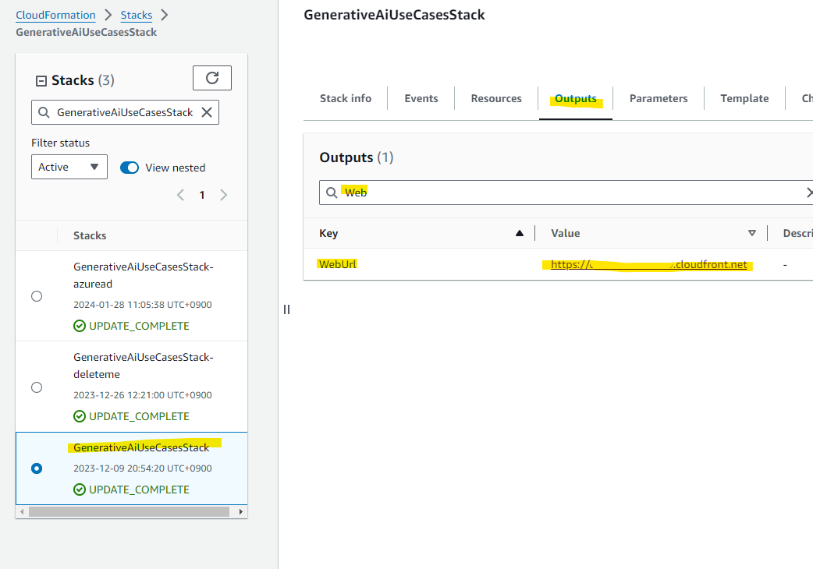
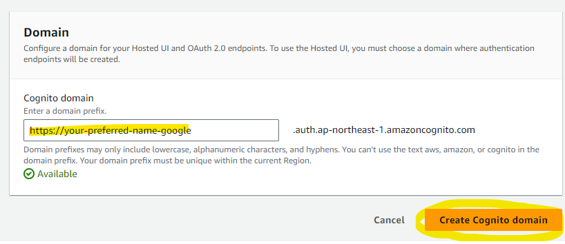
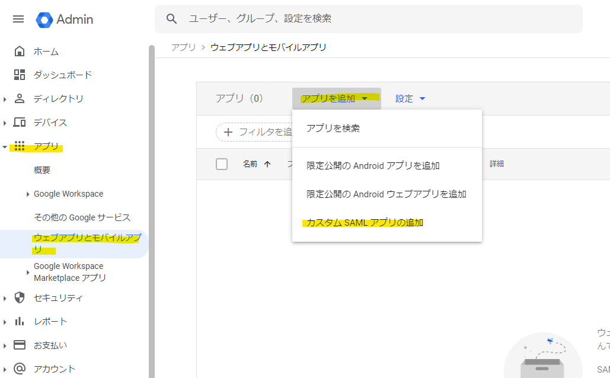
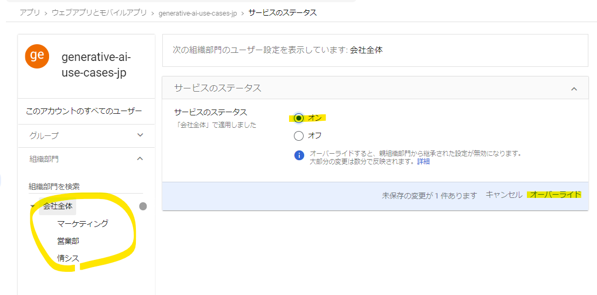

# Google Workspace and SAML Integration

This guide introduces reference procedures for integrating Google Workspace with SAML. Please modify the detailed parameters to match your environment.

# Preliminary Work

First, deploy GenU. After the initial deployment, set up SAML integration between Cognito and Google Workspace.

Open the Outputs tab in the CloudFormation Stack screen and note the WebUrl.



Next, from the Resource tab, note the Physical ID of the Cognito user pool.


# Cognito Configuration: Domain Settings

Proceed with the Cognito domain configuration.
In the Cognito user pool screen, open the App integration tab and display the Domain screen. Since the Cognito Domain is blank, select Create Cognito domain from Actions.


Give it an appropriate name and press Create Cognito domain. In this procedure, we'll use `your-preferred-name-google`. You need to provide a globally unique name.



The Cognito domain has been configured.


# Google Workspace Configuration: SAML Application

Open the Google Workspace admin console from the URL below and proceed with the SAML configuration.
https://admin.google.com/u/0/ac/home

From the application settings screen, click on Add Custom SAML App.



Enter an administrative name for Google Workspace. Any name will do. Here we'll use `generative-ai-use-cases`.


Click the Download metadata button to download `GoogleIDPMetadata.xml`, then press Continue.


Specify the following parameters. Use the User Pool ID confirmed in "Preliminary Work" and the domain name set in "Cognito Configuration: Domain Settings".

ACS URL

```
# Format
https://<entered value>.auth.yourRegion.amazoncognito.com/saml2/idpresponse

# Example
https://your-preferred-name-google.auth.ap-northeast-1.amazoncognito.com/saml2/idpresponse
```

Entity ID

```
# Format
urn:amazon:cognito:sp:<UserPoolID>

# Example
urn:amazon:cognito:sp:ap-northeast-1_Rxt6J1TtI
```

Here's an example of what was entered. After entering, press Continue.


For attributes, configure how Google Directory attributes will integrate with Cognito. Specify `email` for `Primary email`. Then press Finish.


The application has been configured.


# Google Workspace: Access Permission Settings

Open the details screen of the created application to configure access permissions. From the details screen, click on the "Off (all users)" section.


In this sample procedure, we'll grant access to users belonging to the "Company-wide" organization. Select "On" for the entire company and press Override.  
These access permission settings can be configured in detail according to your environment, so please modify them based on your organization's policies.



It has changed to On.


# Cognito Configuration: Federation

Return to the Cognito configuration in the AWS Management Console.
Open the Cognito User Pool screen, go to the Sign-in experience tab, and select Add identity provider.


Select SAML for Google Workspace integration. **Select SAML, not Google.**


Enter an easily identifiable name in the Provider name field. The Provider name specified here will be used in cdk.json in later steps.
Choose file and upload the "GoogleIDPMetadata.xml" downloaded from Google Workspace.


Specify email for User pool attribute.
Enter `email` for SAML attribute and select Add identity provider.


The configuration has been added.


# Cognito Configuration: Hosted UI

Configure the Hosted UI for Google Workspace integration. Select the App Integration tab.


Select the existing App Client.


Press Edit.


Enter the WebUrl value confirmed in [Preliminary Work](#preliminary-work) in both Allowed callback URLs and Allowed sign-out URLs.
If you want to use a [local development environment](./DEVELOPMENT.md) for frontend development, also add `http://localhost:5173` to both Allowed callback URLs and Allowed sign-out URLs.


Select `GoogleWorkspace` for Identity Provider. Also, uncheck the Cognito user pool checkbox as we want to disable authentication using the Cognito user pool.


Press Save changes.


It has been added.


# Editing cdk.json

Now that the configuration is complete, modify the values in cdk.json.

- samlAuthEnabled: Specify `true`. This switches to a SAML-specific authentication screen, and the conventional authentication function using Cognito user pools will no longer be available.
- samlCognitoDomainName: Enter the Cognito Domain name specified in "Cognito Configuration: Domain Settings".
- samlCognitoFederatedIdentityProviderName: Enter the Identity Provider name configured in "Cognito Configuration: Federation".

```json
  "context": {
     <omitted>
    "samlAuthEnabled": true,
    "samlCognitoDomainName": "your-preferred-name-google.auth.ap-northeast-1.amazoncognito.com",
    "samlCognitoFederatedIdentityProviderName": "GoogleWorkspace",
```

After configuration, redeploy to enable SAML integration.
